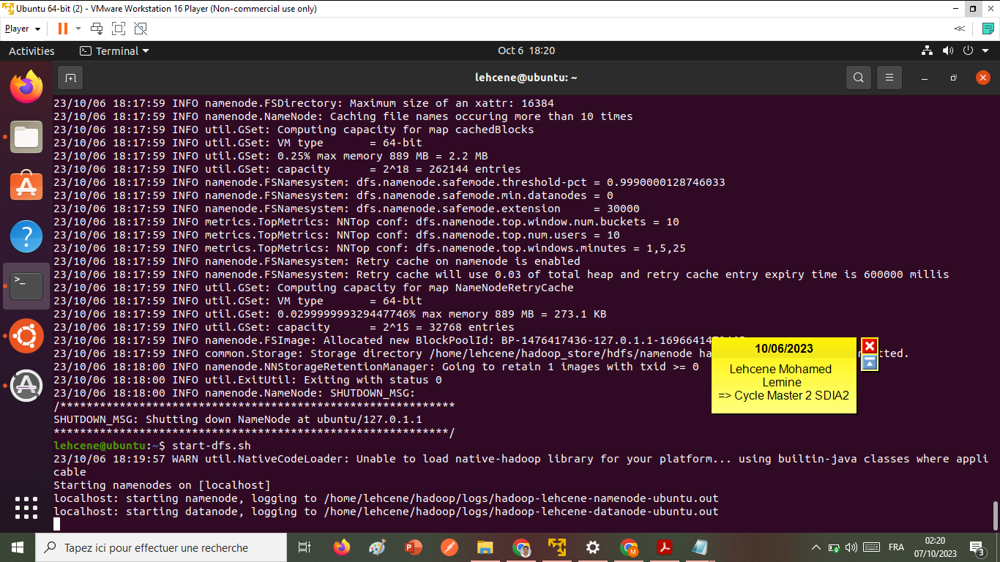
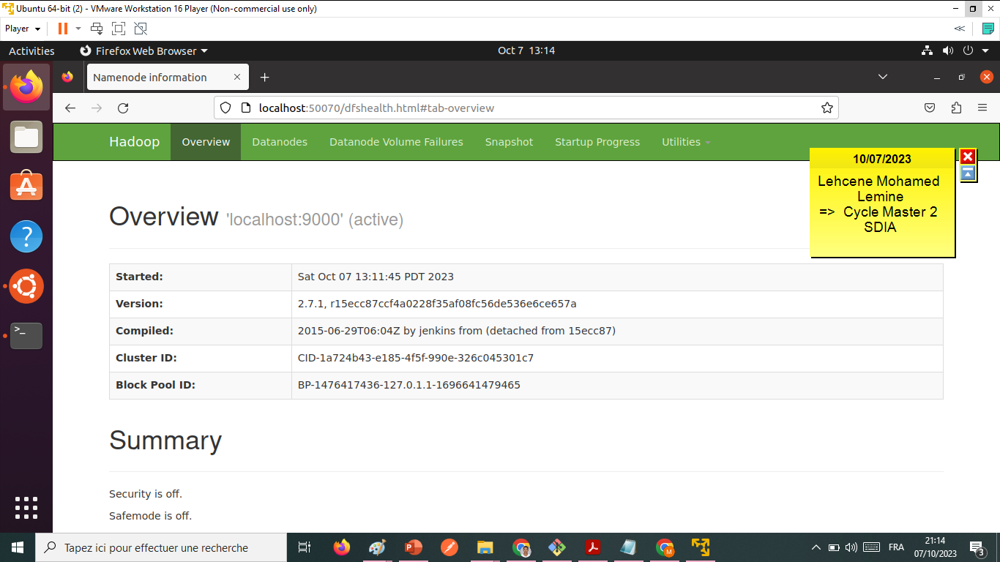
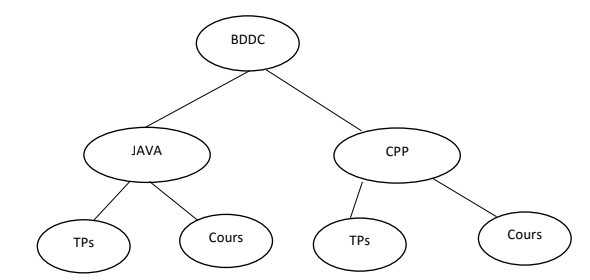

<h2>Installation de Hadoop 2.7 sur Linux</h2>

<h3>1. Télécharger JAVA </h3>
 
<h4>- Taper commande : sudo apt-get update</h4>

  
<h4>- Taper la commande suivante en pour installer JAVA 11 : sudo apet-get install default-jdk</h4>

  

  
<h4>Taper ensuite la commande java -version pour vérifier si java a été bien installée : java -version</h4>

<h3>2. Installer Open SSH Client et Open SSH Server/h3>
<h4>sudo apt-get install openssh-server openssh-client</h4>
<h3>3. Générer des paires de clés privées et publiques : ssh-keygen -t rsa -P ""</h3>

  
<h3>4. Configurer SSH sans mot de passe : cat /home/lehcene/rsa_key.pub >> /home/lehcene/authorized_keys</h3>

  
<h3>5. Vérifier sur localhost par SSH</h3>

<h3>6. Télécharger et installer hadoop 2.7.1</h3>
<h4>- commande télécharge hadoop : wget https://archive.apache.org/dist/hadoop/common/hadoop-2.7.1/hadoop-2.7.1.tar.gz</h4>

<h4>- Puis extraire le dossier en utilisant la commande suivante : tar xzf hadoop-2.7.1.tar.gz</h4>
<h4>- Fiare une Modification sur le Fichiers : bashrc, hadoop-env.sh, core-site.xml, yarn-site.xml, mapred-site.xml.template, copier le fichier mapred-site.xml.template au mapred-site.xml , mapred-site.xml,hdfs-site.xml</h4>

<h3>7. Démarrer le cluster</h3>
<h4>- Formater le Name Node avec la commande suivante : hsfs namenode -format</h4>

  

<h3>- Démarrer les services HDFS avec la commande suivante : start-dfs.sh</h3>

  

<h3>- Démarrer les services YARN avec la commande suivante : start-yarn.sh</h3>

<h3>- Vérifier si les services ont été démarrés avec la commande jps :</h3>

<h3>7- Conulter Hadoop 2.7.1 via Web avec address : localhost:50070</h3>

<h2>TP 1 : Manipulation du système de fichiers HDFS</h2>
<h3> 1- Démarrez les processus Hadoop les commandes : start-dfs.sh et start-yarn.sh</h3>

  

<h3>- Ensuite, vérifiez qu'il est en cours d'exécution avec la commande : jps</h3>

<h3>- Et accéder à l’interface web de NameNode avec http://localhost:50070</h3>

<h3> 2 -Créez dans la racine du HDFS l’arborescence suivante :</h3>

  

  
<h3>Voici on a créer l'arborescence</h3>

  
<h3> 3 - Créez dans le répertoire Cours de CPP les fichiers CoursCPP1, CoursCPP2 et
CoursCPP3. Puis ajoutez du contenu dans les fichiers crées.</h3>

  

<h3> 4 - </h3>
<h3> 5 - Copiez les fichiers CoursCPP1, CoursCPP2 et CoursCPP3 dans le répertoire Cours
de l’JAVA.</h3>

<h3>6. Supprimer le fichier CoursCPP3 dans le répertoire Cours de l’JAVA</h3>

<h3>Et renommer CoursCPP1 et CoursCPP2 par CoursJAVA1 et CoursJAVA2 respectivement.</h3>

<h3>  7 -  Créer un répertoire dans le système de fichier local les fichiers : TP1CPP,TP2CPP,TP1JAVA,TP2JAVA,TP3JAVA.</h3>

  

<h3>  8 - Copier les fichiers TP1CPP,TP2CPP à partir du système de fichier local vers le répertoire TPs de répertoire CPP.</h3>

<h3> 9 - Copier les fichiers TP1CJAVA,TP2JAVA à partir du système de fichier local vers le répertoire TPs de répertoire JAVA.</h3>

<h3> 10 - Afficher tout le contenu du répertoire BDDC d’une manière récursive.</h3>

<h3> 11 - Supprimer le fichier TP1CPP du répertoire TPs.</h3>

<h3> 12 - Supprimer le répertoire Java avec son contenu.</h3>

<h3>Hadoop avec JAVA </h3>
 

 

 

 

